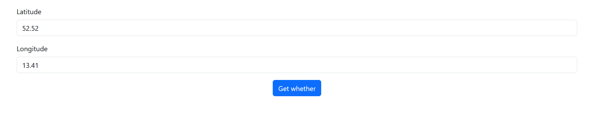
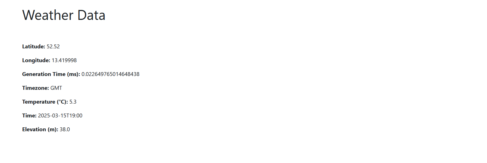

# Weather App with Django 🌦️

This is a **Weather App** built using **Django** that allows users to input their **latitude** and **longitude** to get real-time weather information. The app fetches weather data from a public API and displays essential details such as temperature, humidity, wind speed, and weather description.

## Features 🚀

- **User input**: Takes latitude and longitude as input coordinates 📍
- **Real-time weather data**: Fetches and displays current weather data 🌤️
- **Weather details**: Shows temperature, humidity, wind speed, and weather description 🌬️
- **User-friendly UI**: Simple web interface to enter coordinates and view results 💻
- **Error handling**: Provides error messages when coordinates are invalid ❌

## First look
Latitude and Longitude input entering screen


Showing whether details of entered data


## Requirements 📋

- Python 3.x 🐍
- Django 🔥
- Requests (for making API calls) 🌐
- (Optional) Virtual environment for isolating dependencies 🌱

## Installation 🛠️

Follow these steps to get the weather app running locally.

### 1. Clone the repository

```bash
git clone https://github.com/yourusername/django-weather-app.git
cd django-weather-app
```

### 2. Create a virtual environment

```
python3 -m venv venv
```

#### For mac or linux
```
source venv/bin/activate
```

#### For windows
```
venv\Scripts\activate
```

### 3. Install dependencies

```
pip install -r requirements.txt
```

## 4. Run the Django development server
```
python manage.py runserver
```

## Usage 🖥️

- Navigate to the homepage (http://127.0.0.1:8000/) where you can enter the latitude and longitude coordinates.
- Submit the form with the coordinates and the app will fetch and display the current weather data for that location.
- View the weather details, including temperature, humidity, wind speed, and a brief weather description.

### Example Workflow:

    1. Input: Enter latitude 51.5074 and longitude -0.1278 for London.
    2. Output: The app will show the current weather conditions, including temperature, humidity, and a weather description like "clear sky."